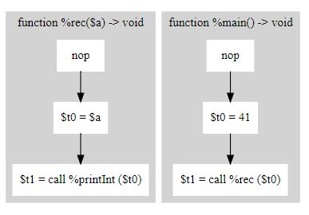

# x86 Complier
## Language Definition
#### The language created is simple that accomadates only 3 types and basic single else statements. The language can handle recursion and multi-layered looping.
### Types
#### Integer, Boolean, Arrays

### Logical
#### AND	and; OR	or; NOT	not

### Assignment
#### LET	let ; VAR	var ; ARRAY	array ; FUNCUNTION	func ; ASSIGN	=

### Conditionals
#### IF	if ; ELSE	else ; WHILE	while ; TRUE	true ; FALSE	false ; RETURN	return

### Seperators
#### OPEN/CLOSE PAREN () ; OPEN/CLOSE BRACE {} ; OPEN/CLOSE BRACKET	[]

### Operations
#### ADD	+ ; SUB	- ; MULTIPLCATION	* ; DIVISION	/ ; GREATER EQUAL	>= ; LESSER EQUAL	<= ; NOT EQUAL	!= ; EQUAL	== ; GREATER THAN	> ; LESS THAN	<

### Syntax
#### COMMA	',' ; SEMICOLON	';' ; COLON	':' ; CALL	'::'

## ANTLR
#### ANTLR converts syntax to token(numerical). These tokens are then converted to Strings. ANTLR also insures that the rules are correct.

### Grammar
#### Conversions: Literals, Operations, Experssions, Call-Expression, Experssion-list, parameter-list, declarations(variable|array|functions), statements(assignment|call|if|while|return),statment-list, and statement-block. These strings would be utilized to create the Abstract Syntax Tree.

## Abstract Syntax Tree
#### An abstract syntax tree(AST) creates objects from the ANTLR strings and connects the objects to create a tree of objects. 

### Creating Objects
#### The objects are seperated into 4 seperate groups Declarations, Statements, Expression (literals), and Experssions (variables/arrays).
#### Declarations contain variables, arrays, and functions.
#### Functions contain statements.
#### Statements contains expressions and delcarations.

## Type Checker
#### Simply searches the declarations and variables for types and checks the value.

### Expressions
#### Expressions must check each linking operation and types to resolve its check. For example:  True == 3 > 1+1, must check 1+1 for int + int operations; 3 > int for int > int operations; True == bool for a bool == bool operation. The check must go through order of operations to check for correct value which is dictated by the AST.

### Variables
#### When a variable is hit it must be deferenced to check for type, in this case the value is still not deferenced and only the type will be revealed in the deference from the AST.

## Intermediate Representation 
#### Converts the AST to a directed graph implementation that represent general instructions to the program.
### Node Path Structure
#### Below is an example of a very simple representation.

## Assembly Code
#### Converts the directed graph implementation to actual x86 code. The code is then written on to a seperate file to be interpreted.

# Credits:
#### A great portion of the testing and code organization is pulled from Professor Demsky, but anything underlining logical explained above is coded solely by me.

